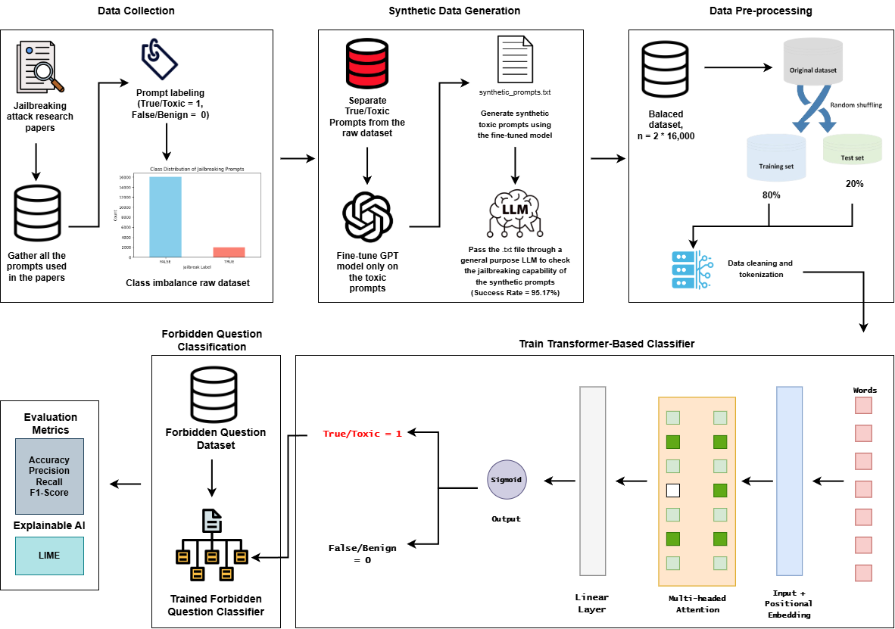

# JailbreakTracer: Explainable Detection of Jailbreaking Prompts in LLMs Using Synthetic Data Generation

## Methodology

## Dataset
Download our dataset from [Kaggle](https://www.kaggle.com/datasets/faiyazabdullah/jailbreaktracer-corpus)

## Codes
Codes for toxic prompt classification can be found in [G1\notebooks](G1\notebooks) directory.\
Codes for forbidden question reasoning can be found in [G2\notebooks](G2\notebooks) directory.

## Model Weights
Download the [Fine-Tuned GPT Model](https://drive.google.com/file/d/1k2F2TVdPMG4df8BA1e2lekYHugp3zhR3/view?usp=sharing) to generate synthetic toxic/jailbreaking prompts.\
Download the [JailBreakBERT Model](https://drive.google.com/uc?export=download&id=1cwQfIAN7_3Yt_jcYjlB3n4Tot2JTTRC2) and the [JailBreakRoBERTa Model](https://drive.google.com/file/d/1Y2H_ZbAv6Vs7Z0eaVDhMztujZOZz-sIS/view?usp=sharing) to classify the prompt whether it is regular or toxic.\
Download the [Forbidden Question Classifier](https://drive.google.com/file/d/1TmsP_Qo67LdDGzrqoh7guxtBwuzaqw9m/view?usp=sharing) to understand the reason why certain questions are flagged as inappropriate, sensitive, or restricted based on predefined rules and ethical considerations.

## Result Comparison with Existing Works

| **Method** | **Accuracy** | **ASR** |
|------------|--------------|---------|
| AutoDefense [Zeng et al., 2024](https://arxiv.org/abs/2403.04783) | 92.91% | 55.74% |
| Llama Guard [Inan et al., 2023](https://arxiv.org/abs/2312.06674) | 94.5% | 37.32% |
| LLM Self Defense [Phute et al., 2023](https://arxiv.org/abs/2308.07308) | 77% | - |
| SMOOTHLLM [Robey et al., 2023](https://arxiv.org/abs/2310.03684) | - | 92% |
| Prompt Adversarial Tuning [Mo et al., 2024](https://arxiv.org/abs/2402.06255) | - | 0.8% |
| Heuristic-based [Chu et al., 2024](https://arxiv.org/abs/2402.05668) | - | 85.0% |
| AutoDAN [Liu et al., 2023](https://arxiv.org/abs/2310.04451) | - | 70% |
| Generation Exploitation [Chu et al., 2024](https://arxiv.org/abs/2402.05668) | - | 68% |
| DrAttack [Li et al., 2024](https://arxiv.org/abs/2402.16914) | - | 62% |
| **JailbreakTracer (Ours)** | **97.25%** | **91.9%** |

## Contact
For any queries, please contact us at msayeedi212049@bscse.uiu.ac.bd
